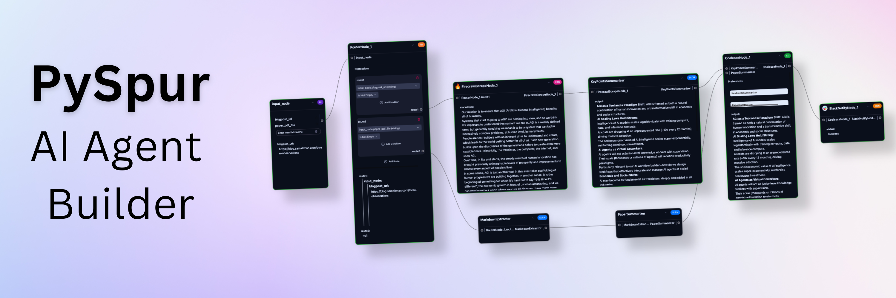

<p align="center"><strong>PySpur es un constructor de agentes de IA en Python. Los ingenieros de IA lo utilizan para crear agentes, ejecutarlos paso a paso e inspeccionar ejecuciones anteriores.</strong></p>

<p align="center">
  <a href="./README.md"></a>
  <a href="./README_CN.md"></a>
  <a href="./README_JA.md"></a>
  <a href="./README_KR.md"></a>
  <a href="./README_DE.md"></a>
  <a href="./README_FR.md"></a>
  <a href="./README_ES.md"></a>
</p>

<p align="center">
  <a href="https://docs.pyspur.dev/" target="_blank">
    
  </a>
  <a href="https://calendly.com/d/cnf9-57m-bv3/pyspur-founders" target="_blank">
    
  </a>
  <a href="https://forms.gle/5wHRctedMpgfNGah7" target="_blank">
    
  </a>
  <a href="https://discord.gg/7Spn7C8A5F">
    
  </a>
</p>

https://github.com/user-attachments/assets/1ebf78c9-94b2-468d-bbbb-566311df16fe

# 🕸️ ¿Por qué PySpur?

- ✅ **Desarrollo Guiado por Pruebas**: Construye flujos de trabajo, ejecuta casos de prueba e itera.
- 👤 **Humano en el Bucle**: Flujos de trabajo persistentes que esperan aprobación o rechazo humano.
- 🔄 **Bucles**: Llamadas iterativas a herramientas con memoria.
- 📤 **Carga de Archivos**: Sube archivos o pega URLs para procesar documentos.
- 📋 **Salidas Estructuradas**: Editor de interfaz para esquemas JSON.
- 🗃️ **RAG**: Analiza, segmenta, incrusta y actualiza datos en una base de datos vectorial.
- 🖼️ **Multimodal**: Soporte para video, imágenes, audio, textos y código.
- 🧰 **Herramientas**: Slack, Firecrawl.dev, Google Sheets, GitHub y más.
- 🧪 **Evaluaciones**: Evalúa agentes en conjuntos de datos del mundo real.
- 🚀 **Despliegue con un clic**: Publica como una API e intégrala donde desees.
- 🐍 **Basado en Python**: Agrega nuevos nodos creando un solo archivo Python.
- 🎛️ **Soporte para Cualquier Proveedor**: Más de 100 proveedores de LLM, embedders y bases de datos vectoriales.

# ⚡ Inicio Rápido

Esta es la forma más rápida de comenzar. Se requiere Python 3.11 o superior.

1. **Instala PySpur:**
    ```sh
    pip install pyspur
    ```

2. **Inicializa un nuevo proyecto:**
    ```sh
    pyspur init my-project
    cd my-project
    ```
    Esto creará un nuevo directorio con un archivo `.env`.

3. **Inicia el servidor:**
    ```sh
    pyspur serve --sqlite
    ```
    Por defecto, esto iniciará la aplicación PySpur en `http://localhost:6080` utilizando una base de datos SQLite.
    Se recomienda configurar una URL de instancia de Postgres en el archivo `.env` para obtener una experiencia más estable.

4. **[Opcional] Configura tu entorno y añade claves API:**
    - **A través de la interfaz de la aplicación**: Navega a la pestaña de API Keys para añadir claves de proveedores (OpenAI, Anthropic, etc.)
    - **Configuración manual**: Edita el archivo `.env` (recomendado: configura postgres) y reinicia con `pyspur serve`

¡Eso es todo! Haz clic en "New Spur" para crear un flujo de trabajo, o comienza con una de las plantillas predefinidas.

# ✨ Beneficios Principales

## Puntos de Interrupción con Humano en el Bucle:

Estos puntos de interrupción pausan el flujo de trabajo cuando se alcanzan y lo reanudan tan pronto como un humano lo aprueba.
Permiten la supervisión humana para flujos de trabajo que requieren garantía de calidad: verifique las salidas críticas antes de que el flujo de trabajo continúe.

https://github.com/user-attachments/assets/98cb2b4e-207c-4d97-965b-4fee47c94ce8

## Depuración a Nivel de Nodo:

https://github.com/user-attachments/assets/6e82ad25-2a46-4c50-b030-415ea9994690

## Multimodal (Sube archivos o pega URLs)

PDFs, Videos, Audio, Imágenes, ...

https://github.com/user-attachments/assets/83ed9a22-1ec1-4d86-9dd6-5d945588fd0b

## Bucles


## RAG

### Paso 1) Crear Colección de Documentos (Segmentación + Análisis)

https://github.com/user-attachments/assets/c77723b1-c076-4a64-a01d-6d6677e9c60e

### Paso 2) Crear Índice Vectorial (Incrustación + Actualización en DB Vectorial)

https://github.com/user-attachments/assets/50e5c711-dd01-4d92-bb23-181a1c5bba25

## Bloques Modulares

https://github.com/user-attachments/assets/6442f0ad-86d8-43d9-aa70-e5c01e55e876

## Evaluar el Rendimiento Final

https://github.com/user-attachments/assets/4dc2abc3-c6e6-4d6d-a5c3-787d518de7ae

## Próximamente: Auto-mejora

https://github.com/user-attachments/assets/5bef7a16-ef9f-4650-b385-4ea70fa54c8a

# 🛠️ Configuración de Desarrollo de PySpur
#### [ Instrucciones para el desarrollo en sistemas tipo Unix. Desarrollo en Windows/PC no es soportado ]

Para el desarrollo, sigue estos pasos:

1. **Clona el repositorio:**
    ```sh
    git clone https://github.com/PySpur-com/pyspur.git
    cd pyspur
    ```

2. **Inicia utilizando docker-compose.dev.yml:**
    ```sh
    docker compose -f docker-compose.dev.yml up --build -d
    ```
    Esto iniciará una instancia local de PySpur con recarga en caliente habilitada para el desarrollo.

3. **Personaliza tu configuración:**
    Edita el archivo `.env` para configurar tu entorno. Por defecto, PySpur utiliza una base de datos PostgreSQL local. Para usar una base de datos externa, modifica las variables `POSTGRES_*` en el archivo `.env`.

# ⭐ Apóyanos

¡Puedes apoyarnos en nuestro trabajo dándonos una estrella! ¡Gracias!


Tu retroalimentación será enormemente apreciada.
Por favor [dinos](mailto:founders@pyspur.dev?subject=Feature%20Request&body=I%20want%20this%20feature%3Ai) qué características de esa lista te gustaría ver a continuación o solicita nuevas funcionalidades.
